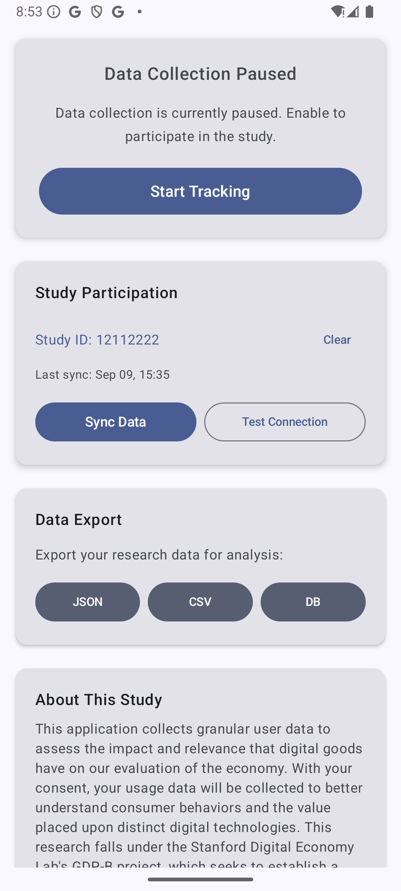
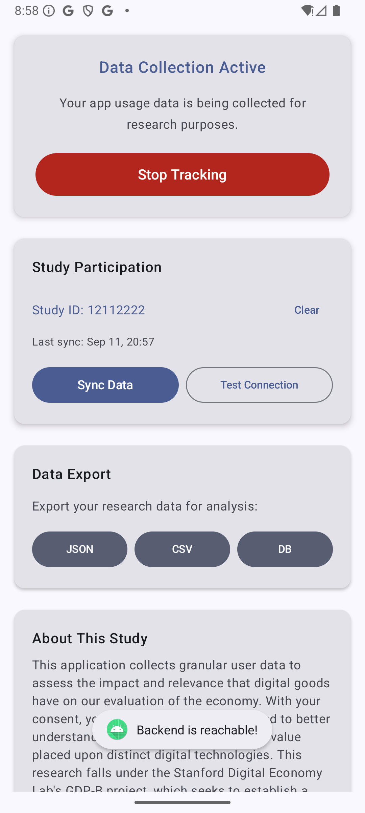

# Project GDP-B Usage Statistics Android OS Application

This mobile application was built with the purpose of collecting granular user data to assess the impact and relevance that digital goods have on our evaluation of the economy. With user consent, a cohort of participants will be assembled, and their usage data will be collected in an attempt to better understand their behavior and the value they place upon distinct digital technologies. The development of this app falls under the Stanford Digital Economy Lab's GDP-B project, which seeks to establish a new method of economic assessment that considers the enormous effects of contemporary technologies that are often not factored into economic change, or done so ineffectively.
## App Screenshots
<div align="center">
   
   
</div>

*User can toggle between tracking and non-tracking mode for full autonomy.*

<div align="center">
   
   
</div>

*Contains buttons to check connection to backend for proper data transfer, as well as an alert once a manual sync has been completed.*

## Features

- **Real-Time Data Collection**: Granular app usage tracking with 30-second intervals
- **Multi-Tenant Database**: Separate user data with aggregated research database
- **Comprehensive Export**: JSON, CSV, and SQLite database export functionality
- **Privacy-First Design**: Local data storage with user-controlled export
- **Smart App Filtering**: Excludes system apps and focuses on user-facing applications
- **Session Tracking**: Detailed logging of app usage sessions (10+ seconds)
- **Background Collection**: Continues data collection when tracking is "paused"
- **Modern Android Stack**: Kotlin, Jetpack Compose, Room database, Coroutines

## Technical Stack

- **Language**: Kotlin
- **UI Framework**: Jetpack Compose
- **Architecture**: MVVM with Repository pattern
- **Database**: Room (SQLite) with multi-tenant support and optimized indexing
- **Dependency Injection**: Manual DI with ViewModelFactory
- **Coroutines**: For asynchronous operations
- **Flow**: For reactive data streams

## Quick Start

1. **Clone the repository**
   ```bash
   git clone <repository-url>
   cd UsageStatisticsApp
   ```

2. **Open in Android Studio**
   - Import the project
   - Sync Gradle dependencies
   - Build and run

3. **First Run Setup**
   - Enter your unique Study ID when prompted
   - Grant "Usage Access" permission in Android settings
   - Start tracking and data collection

4. **Data Export**
   - Use the export buttons on the main screen
   - Choose JSON, CSV, or SQLite database format
   - Share via email, cloud storage, or file transfer

## Multi-Tenant Database Architecture

The app implements a sophisticated multi-tenant database system designed for research studies with the database name `usage_stats_database`:

### **User Identification System**
- **Unique Study ID**: Each user enters a unique identifier (e.g., "ABC123")
- **User Profile**: Stores registration date, device ID, and study group information
- **Session Management**: Tracks individual user sessions with detailed timing

### **Database Structure**

#### **User-Specific Data (Granular)**
- **User Profile**: `user_profile` table with user identification
- **User Sessions**: `user_sessions` table with session start/end times
- **User Usage Stats**: `user_usage_stats` table with detailed app usage per session
- **Real-Time Session Tracking**: Exact timing of when users open/close apps with 10-second granularity

#### **Master Database (Aggregated)**
- **Master Usage Stats**: `master_usage_stats` table with anonymized, aggregated data
- **Research Data**: Summarized statistics across all users
- **Study Periods**: Data organized by time periods (Week 1, Month 1, etc.)

### **Data Flow**
1. **User Setup**: User enters Study ID → Creates user profile → Initializes user database
2. **Real-Time Tracking**: App tracks user sessions and app usage in real-time with 10-second granularity
3. **Data Collection**: Detailed usage data stored in user-specific tables with optimized indexing
4. **Aggregation**: User data aggregated into master database for research analysis
5. **Privacy**: Master database contains only anonymized, summarized data

## Database Management

The app automatically manages database cleanliness:

- **Automatic Cleanup**: Each time you refresh usage statistics, the database is cleared and repopulated with fresh, filtered data
- **Smart Filtering**: Only user-facing apps with actual usage data are stored
- **Migration Support**: Database version 4 includes optimized tables and automatic migration
- **Fallback Strategy**: If migration fails, the database is automatically destroyed and recreated
- **Real-Time Session Management**: Automatic session tracking with proper cleanup
- **Optimized Indexing**: Database indexes for better query performance

This ensures you always see clean, relevant data without system services or background components cluttering your statistics.

## Project Structure

```
app/src/main/java/com/example/usagestatisticsapp/
├── data/
│   ├── AppDatabase.kt              # Room database configuration
│   ├── UserProfile.kt              # User identification entity
│   ├── UserUsageStats.kt           # Detailed usage tracking entity
│   ├── MasterUsageStats.kt         # Aggregated research data entity
│   ├── UserProfileDao.kt           # User profile data access
│   ├── UserUsageStatsDao.kt        # Usage statistics data access
│   ├── MasterUsageStatsDao.kt      # Master database data access
│   ├── UserProfileRepository.kt    # User profile repository
│   ├── UserUsageStatsRepository.kt # Usage statistics repository
│   ├── MasterUsageStatsRepository.kt # Master database repository
│   ├── RealTimeSessionTracker.kt   # Real-time session tracking
│   ├── DataAggregationService.kt   # Data aggregation for research
│   └── DataExportService.kt        # Data export functionality
├── ui/
│   ├── UserSetupScreen.kt          # Study ID input screen
│   ├── UserSetupUiState.kt         # User setup UI state
│   ├── MainScreen.kt               # Main app screen with Stanford HAI branding
│   └── UserManagementViewModel.kt  # User management and tracking
└── MainActivity.kt                 # Main activity
```

## Key Components

### UserProfile
Database entity that stores user identification and study information:
- Study ID (unique identifier)
- Registration date
- Device ID
- Study group assignment
- Last active date


### UserUsageStats (Enhanced)
Detailed app usage tracking with session context and additional metadata:
- User ID and session ID references
- App package name and display name
- Exact start and end times
- Duration in milliseconds
- Interaction count
- Timestamp
- **New**: App category (Social, Productivity, Gaming, etc.)
- **New**: Device orientation (portrait/landscape)
- **New**: Battery level when session started
- **New**: Network type (WiFi, Mobile, etc.)
- **New**: Active status for real-time tracking

### MasterUsageStats
Aggregated, anonymized data for research:
- App package name and display name
- Total users count
- Average usage time
- Total usage time
- Total sessions count
- Study period classification

### UserManagementViewModel
Handles user setup and real-time session management:
- User ID validation and setup
- Real-time session tracking initialization
- Real-time usage data collection with 10-second granularity
- Data aggregation for master database
- Privacy-compliant data handling

### RealTimeSessionTracker
Manages real-time user sessions and app usage tracking:
- **Real-time app usage monitoring** with 10-second granularity
- **Automatic session start/end detection**
- **App switch detection** and logging
- **Session-based data organization**
- **Device information collection** (orientation, battery, network)
- **App categorization** for research analysis
- **Optimized performance** with proper indexing

### DataAggregationService
Aggregates user data for research purposes:
- User data summarization
- Master database population
- Study period classification
- Privacy-preserving aggregation

## Permissions

The app requires the following permissions:
- **`PACKAGE_USAGE_STATS`**: To access usage statistics (system-level permission)
- **`BIND_ACCESSIBILITY_SERVICE`**: For accessibility features (system-level permission)
- **`ACCESS_NETWORK_STATE`**: For network type detection in session tracking

## Database Schema

### Database Tables
- **`user_profile`**: User identification and study information
- **`user_usage_stats`**: Detailed app usage per session with metadata
- **`master_usage_stats`**: Aggregated, anonymized research data
- **Optimized Indexes**: Performance indexes on frequently queried columns


### Schema Details
- **User Profile**: `userId` (PK), `registrationDate`, `deviceId`, `studyGroup`, `lastActiveDate`
- **User Usage Stats**: `id` (PK), `userId`, `sessionId`, `appPackageName`, `appName`, `startTime`, `endTime`, `duration`, `interactionCount`, `timestamp`, `isActive`, `appCategory`, `deviceOrientation`, `batteryLevel`, `networkType`
- **Master Usage Stats**: `id` (PK), `appPackageName`, `appName`, `totalUsers`, `averageUsageTime`, `totalUsageTime`, `totalSessions`, `studyPeriod`, `lastUpdated`

## Research Features

### **Study Management**
- **Unique User IDs**: Each participant gets a unique Study ID
- **Real-Time Session Tracking**: Detailed session-based data collection with 10-second granularity
- **Data Aggregation**: Automatic aggregation for research analysis
- **Privacy Protection**: Anonymized master database

### **Data Analysis Ready**
- **Dashboard-Ready**: Master database structured for dashboard integration
- **Time Periods**: Data organized by study periods (Week 1, Month 1, etc.)
- **App Usage Patterns**: Detailed usage patterns per user and aggregated
- **Session Analysis**: Session-based usage analysis capabilities
- **Enhanced Metadata**: App categories, device orientation, battery, network data

### **Privacy & Compliance**
- **Local Storage**: All user data stored locally on device
- **Anonymized Aggregation**: Master database contains only anonymized data
- **User Consent**: Clear privacy notice and consent process
- **Data Control**: Users can withdraw from study at any time

## Real-Time Session Tracking

### **Performance-Optimized Tracking**
- **Minimum Usage Duration**: Only logs app usage sessions of 10+ seconds
- **Monitoring Interval**: Checks app usage every 30 seconds for optimal performance
- **App Switch Detection**: Automatically detects when users switch between apps
- **Background Collection**: Continues tracking even when user pauses via UI toggle

### **Enhanced Metadata Collection**
- **App Categories**: Automatic categorization (Social, Productivity, Gaming, Browser)
- **Device Context**: Orientation, battery level, network type
- **Performance Optimized**: Efficient database operations with proper indexing

### **Research Benefits**
- **Granular Data**: Session-level precision for detailed usage analysis
- **Contextual Information**: Device and environmental context
- **Export Flexibility**: Multiple data formats for analysis
- **Privacy Compliant**: Local storage with user-controlled data sharing

## Data Export

The app includes comprehensive data export functionality for research analysis:

### Export Formats
- **JSON Export**: Structured data for programming languages and databases
- **CSV Export**: Spreadsheet-compatible format for Excel/Google Sheets
- **SQLite Export**: Complete database file for direct SQL analysis

### Export Features
- **Complete Data**: All tables (user profiles, usage stats, master data)
- **Timestamped Files**: Automatic file naming with date/time
- **Share Integration**: Email, cloud storage, file transfer options
- **Privacy Compliant**: User-initiated export only

### Usage
1. Open the app and navigate to the main screen
2. Find the "Data Export" section below the tracking toggle
3. Tap JSON, CSV, or DB button to export
4. Choose sharing method (email, Google Drive, etc.)

For detailed export documentation, see `EXPORT_FUNCTIONALITY.md`.

## Contributing

This is a research project for Stanford HAI. For questions about the study or technical issues:

1. **Technical Issues**: Create an issue in this repository
2. **Research Questions**: Contact the Stanford HAI research team
3. **Code Contributions**: Fork the repository and submit a pull request

## License

This project is developed for academic research purposes at Stanford University's Institute for Human Centered Artificial Intelligence (HAI).
